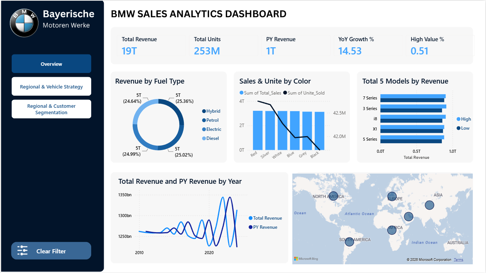

# 🚗 BMW Sales Analytics Dashboard

## 📊 Overview

A professional Power BI dashboard analyzing BMW sales data to provide actionable insights into revenue performance, vehicle strategy, regional sales, and customer segmentation.

---

## 🖼️ Dashboard Preview

### 1. Overview



The Overview dashboard provides a high-level view of BMW sales performance, including:

- Total Revenue
- Total Units
- PY Revenue
- YoY Growth %
- High Value %
- Revenue by Fuel Type
- Sales & Units by Color
- Top 5 Models by Revenue
- Revenue by Year
- Regional Revenue

---

### 2. Regional & Vehicle Strategy


This dashboard focuses on vehicle and pricing analysis, including:

- Average Selling Price
- Eco Share %
- Average Engine Size
- Top Model
- Diesel Share %
- Price vs. Mileage Strategy
- Unit Sold by Color
- Sales Volume by Fuel Type
- Transmission Preference by Region

---

### 3. Regional & Customer Segmentation


This dashboard provides regional and customer-focused insights, including:

- North America Revenue
- Europe Revenue
- Asia Revenue
- High Class Transactions
- Average Units per Deal
- Revenue by Region
- Revenue by Fuel Type
- Average Price by Region
- Average Engine Size by Year and Region

---

## 🛠️ 1. Data Preparation & Transformation

- **Data Source:** BMW sales dataset containing vehicle, sales, pricing, fuel type, color, region, and transmission information.
- **Data Cleaning:** Cleaned and standardized the raw dataset using Power Query.
- **Data Formatting:** Prepared numerical, categorical, and date fields for analysis.
- **Data Transformation:** Created calculated and categorized fields required for vehicle, regional, and customer analysis.

---

## 📅 2. Data Modeling

Created a structured Power BI data model to enable analysis across:

- Revenue
- Units Sold
- Vehicle Models
- Regions
- Fuel Types
- Colors
- Transmission
- Vehicle Attributes
- Years

A dedicated **Measures Table** was created to keep DAX calculations organized.

---

### 🔹 Core KPIs

```DAX
Total Revenue =
SUM('BMW Sales'[Price_USD])

Total Units Sold =
SUM('BMW Sales'[Units_Sold])

Avg Selling Price =
AVERAGE('BMW Sales'[Price_USD])

Avg Engine Size =
AVERAGE('BMW Sales'[Engine_Size_L])

Asia Revenue =
CALCULATE(
    [Total Revenue],
    'BMW Sales'[Region] = "Asia"
)

Europe Revenue =
CALCULATE(
    [Total Revenue],
    'BMW Sales'[Region] = "Europe"
)

North America Revenue =
CALCULATE(
    [Total Revenue],
    'BMW Sales'[Region] = "North America"
)

South America Revenue =
CALCULATE(
    [Total Revenue],
    'BMW Sales'[Region] = "South America"
)

NA Revenue =
CALCULATE(
    [Total Revenue],
    'BMW Sales'[Region] = "NA"
)

Asia Revenue =
CALCULATE(
    [Total Revenue],
    'BMW Sales'[Region] = "Asia"
)

Europe Revenue =
CALCULATE(
    [Total Revenue],
    'BMW Sales'[Region] = "Europe"
)

North America Revenue =
CALCULATE(
    [Total Revenue],
    'BMW Sales'[Region] = "North America"
)

South America Revenue =
CALCULATE(
    [Total Revenue],
    'BMW Sales'[Region] = "South America"
)

NA Revenue =
CALCULATE(
    [Total Revenue],
    'BMW Sales'[Region] = "NA"
)

High Class Sales =
CALCULATE(
    [Total Units Sold],
    'BMW Sales'[Vehicle_Class] = "High"
)

Medium Class Sales =
CALCULATE(
    [Total Units Sold],
    'BMW Sales'[Vehicle_Class] = "Medium"
)

Low Class Sales =
CALCULATE(
    [Total Units Sold],
    'BMW Sales'[Vehicle_Class] = "Low"
)
