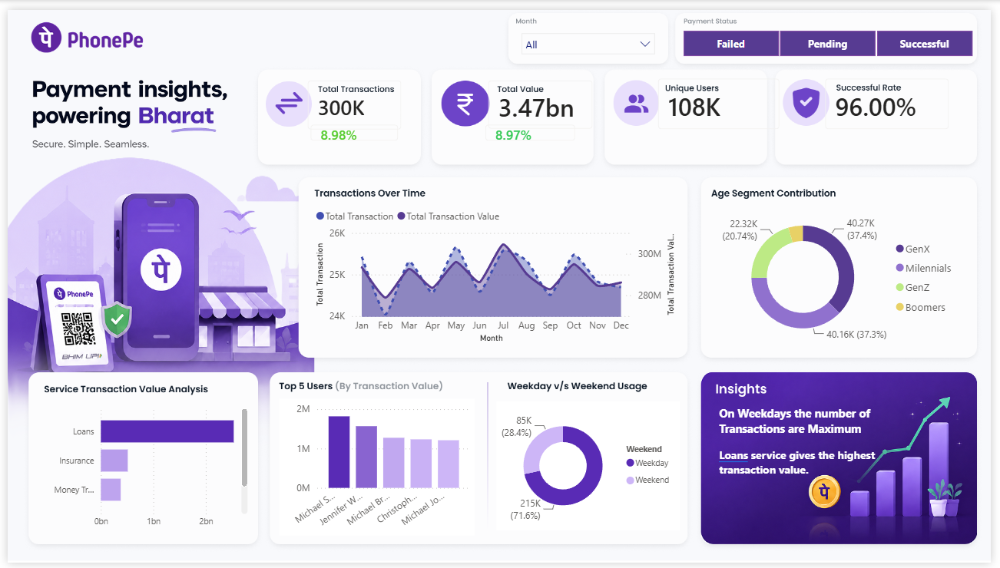

# 📱 PhonePe Payment Insights Dashboard



## 📊 Overview
A professional Power BI dashboard analyzing 300K+ transaction records to provide actionable insights into user demographics, payment behaviors, and service usage.

---

## 🛠️ 1. Data Preparation & Transformation
- **Data Source:** Processed 300,000 rows of raw transaction data using Power Query.
- **Payment Status Formatting:** Standardized payment statuses by keeping "Failed" and "Successful", and replacing all other extraneous values with **"Pending"** for clarity.
- **Demographic Segmentation:** Added a conditional column in the `All_Users` table to group users by generation:
  - **GenZ:** `<= 26`
  - **Millennials:** `<= 42`
  - **GenX:** `<= 58`
  - **Boomers:** `Else` (> 58)

---

## 📅 2. Data Modeling
Generated a custom **Date Table** to enable accurate time-intelligence tracking (e.g., Month-over-Month metrics) across the dashboard.

```dax
Date_Table = ADDCOLUMNS(
    CALENDAR(MIN(All_Transactions[Date]), MAX(All_Transactions[Date])),
    "Year", YEAR([Date]),
    "Month No.", MONTH([Date]),
    "Month", FORMAT([Date], "mmm"),
    "Quarter", "Q" & FORMAT([Date], "Q"),
    "Weekday", FORMAT([Date], "dddd"),
    "Day No.", WEEKDAY([Date], 2),
    "Weekend", IF(WEEKDAY([Date], 2) >= 6, "Weekend", "Weekday")
)
```

## 📈 3. KPIs & DAX Measures
Created a dedicated Measures Table to keep the data model organized.

```Core Metrics
Total Transaction Value = SUM(All_Transactions[Amount])
Total Transactions = COUNT(All_Transactions[Transaction_ID])
Successful Transactions = CALCULATE([Total Transactions], All_Transactions[Payment_Status] = "Successful")
Success Rate = DIVIDE([Successful Transactions], [Total Transactions]) // Formatted as %
Total Users = DISTINCTCOUNT(All_Users[User_ID])
```

```Time-Intelligence (MoM%)
Trans Value PM = CALCULATE([Total Transaction Value], DATEADD(Date_Table[Date], -1, MONTH))
Trans Value MoM% = DIVIDE([Total Transaction Value] - [Trans Value PM], [Trans Value PM], 0) // Formatted as %
Total Trans PM = CALCULATE([Total Transactions], DATEADD(Date_Table[Date], -1, MONTH))
Total Trans MoM% = DIVIDE([Total Transactions] - [Total Trans PM], [Total Trans PM], 0) // Formatted as %
```

## Visualizations & Interactivity
Design Theme: Leveraged a premium dark-purple aesthetic to match PhonePe's brand identity.
Global Slicers: The dashboard is fully interactive, allowing users to filter by Month and Payment Status.

## Custom Tooltips:
### Service Insights: ### Hovering over the Service Transaction Value Analysis bar chart reveals specific underlying service categories.
### Demographic Insights: ### Hovering over the Weekday v/s Weekend Usage donut chart displays the exact breakdown by Age Segment (GenZ, Millennials, GenX, Boomers).
