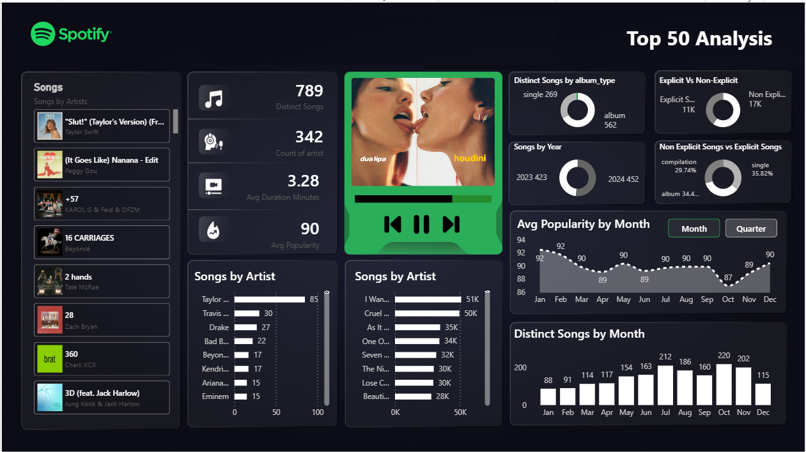

### Spotify Dashboard using Power BI


### Project Overview
This project analyzes the Spotify Top-50 dataset using Power BI. It covers data cleaning, modeling, DAX, KPIs, and dashboard design.

### Measures Table
A dedicated Measures table was created to keep every DAX measure in one place. This keeps the model organized, improves maintainability, and follows Power BI best practices.

### 31 KPI Measures
31 KPI's are created out of which 5-10 KPI's are used , we can design all dahsboard accordingly and use the KPI's we want.

```dax
1. Total Songs = COUNTROWS('Top-50-World')
2. Distinct Songs = DISTINCTCOUNT('Top-50-World'[song])
3. Distinct Artists = DISTINCTCOUNT('Top-50-World'[artist])
4. Avg Popularity = AVERAGE('Top-50-World'[popularity])
5. Max Popularity = MAX('Top-50-World'[popularity])
6. Min Popularity = MIN('Top-50-World'[popularity])
7. Popularity Range = [Max Popularity]-[Min Popularity]
8. Avg Duration Minutes = AVERAGEX('Top-50-World','Top-50-World'[duration_ms]/60000)
9. Max Duration Minutes = MAXX('Top-50-World','Top-50-World'[duration_ms]/60000)
10. Min Duration Minutes = MINX('Top-50-World','Top-50-World'[duration_ms]/60000)
11. Explicit Songs = CALCULATE(COUNTROWS('Top-50-World'),'Top-50-World'[is_explicit]=TRUE())
12. Non Explicit Songs = CALCULATE(COUNTROWS('Top-50-World'),'Top-50-World'[is_explicit]=FALSE())
13. Pct Explicit Songs = DIVIDE([Explicit Songs],[Total Songs],0)
14. Avg Popularity Explicit = CALCULATE(AVERAGE('Top-50-World'[popularity]),'Top-50-World'[is_explicit]=TRUE())
15. Avg Popularity Non Explicit = CALCULATE(AVERAGE('Top-50-World'[popularity]),'Top-50-World'[is_explicit]=FALSE())
16. Avg Position = AVERAGE('Top-50-World'[position])
17. Position 1 Songs = CALCULATE(COUNTROWS('Top-50-World'),'Top-50-World'[position]=1)
18. Position 1 Artists = CALCULATE(DISTINCTCOUNT('Top-50-World'[artist]),'Top-50-World'[position]=1)
19. Top 10 Entries = CALCULATE(COUNTROWS('Top-50-World'),'Top-50-World'[position]<=10)
20. Avg Tracks Per Album = AVERAGE('Top-50-World'[total_tracks])
21. Album Type Count = DISTINCTCOUNT('Top-50-World'[album_type])
22. Singles Count = CALCULATE(COUNTROWS('Top-50-World'),'Top-50-World'[album_type]="single")
23. Albums Count = CALCULATE(COUNTROWS('Top-50-World'),'Top-50-World'[album_type]="album")
24. Entries Per Song = CALCULATE(COUNTROWS('Top-50-World'),ALLEXCEPT('Top-50-World','Top-50-World'[song]))
25. Entries Per Artist = CALCULATE(COUNTROWS('Top-50-World'),ALLEXCEPT('Top-50-World','Top-50-World'[artist]))
26. Distinct Songs Per Artist = CALCULATE(DISTINCTCOUNT('Top-50-World'[song]),ALLEXCEPT('Top-50-World','Top-50-World'[artist]))
27. Avg Popularity Per Artist = CALCULATE(AVERAGE('Top-50-World'[popularity]),ALLEXCEPT('Top-50-World','Top-50-World'[artist]))
28. Avg Release Year = AVERAGEX('Top-50-World',YEAR('Top-50-World'[release_date]))
29. Newest Release Year = MAXX('Top-50-World',YEAR('Top-50-World'[release_date]))
30. Oldest Release Year = MINX('Top-50-World',YEAR('Top-50-World'[release_date]))
31. Song Age Years = AVERAGEX('Top-50-World',YEAR(TODAY())-YEAR('Top-50-World'[release_date]))
```

### Insights
The dashboard helps analyze artist performance, popularity, album types, explicit content, duration, rankings, and release trends using interactive Power BI visuals.
