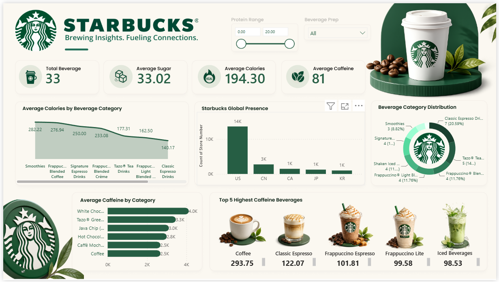

# Starbucks Global Operations & Nutritional Analysis ☕📊

## 📌 Project Overview
This Power BI project provides a comprehensive analysis of Starbucks' global store footprint alongside a detailed nutritional breakdown of its beverage offerings. 

## 📂 Data Sources & Model Structure
The analysis utilizes two datasets. Notably, there is **no relationship** established between these two files; they serve distinct purposes in the report:
* **`starbucks.csv`**: Exclusively used to generate nutritional visuals and track beverage KPIs.
* **`directory.csv`**: Exclusively used for generating the geographical map of store locations.

## ⚙️ Steps Performed

### 1. Data Transformation
* **Cleaning Values:** Reviewed the datasets to ensure data consistency.
* **Handling Nulls:** Removed empty and null values to prevent skewing the final visualizations.

### 2. DAX & KPI Development
To keep everything well-structured and centralized, a new dedicated table called **`measures`** was created strictly to store all the KPIs. 

The following DAX formulas were written to calculate the core metrics:

  ```dax
Total Beverages = DISTINCTCOUNT(starbucks[Beverages])
Avg Calories = AVERAGE(starbucks[Calories])
Avg sugar = AVERAGE(starbucks[sugar (g)])
Avg Caffeine = AVERAGE(starbucks[Caffeine (mg)])
```

### 3. Visualization
Transitioned to the canvas to build out the dashboard visuals.

Utilized the structured measures to create the top-level KPI cards and leveraged the cleaned **`starbucks.csv`** and **`directory.csv`** data to build out the bar charts, donut charts, and the global map.
